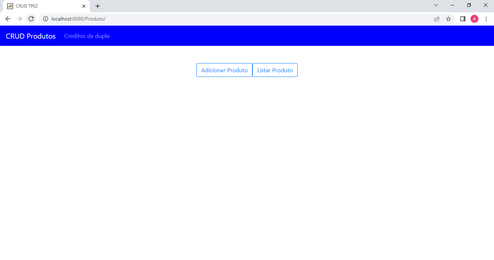
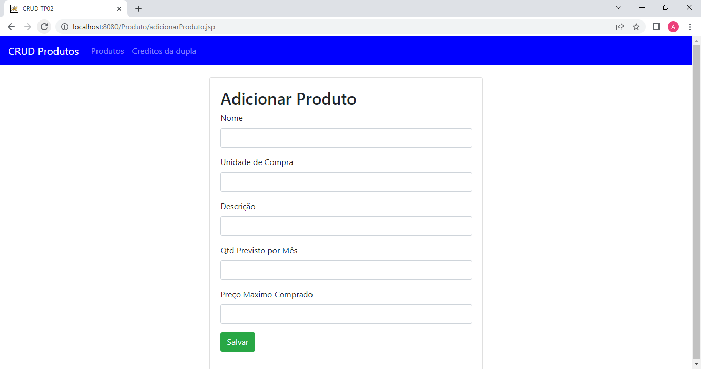

# SWII5  - CRUD Produto

Uma aplicação CRUD (Create, Read, Update and Delete).

## Requisitos

Atenção:

[x]  Obrigatório o nome da dupla nos arquivos .java na forma de comentários.

[x] Deverá entregar o projeto em forma compactada (toda a pasta)

apresentação dos funcionários desta atividade.

[x] Diferencial: Criar uma página específica para créditos da dupla.

## Demonstração

Os prints da tela:

tela principal

Tela com os alunos

Crud com dados

formulario alunos

Link do projeto funcionando: https://youtu.be/-886O_Y4AZs

## Autores

- Andreza do Nascimento Pessoa  Matricula: Cb3012191
- Lidiane Souza Soares  CB3012026

